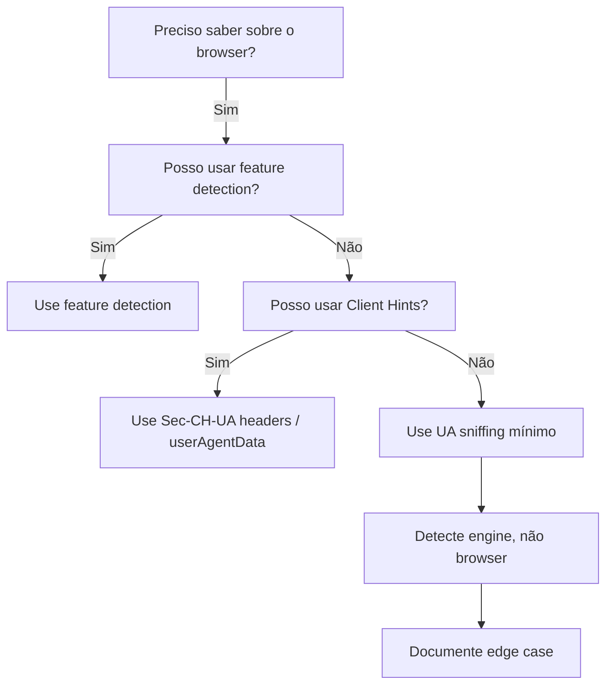

# Browser Detection Using User Agent — Guia de Boas Práticas

## 1. Premissa Fundamental

> "It's very rarely a good idea to use user agent sniffing to detect a browser, but there are edge cases that require it."

**Feature detection** (detectar capacidades) é quase sempre preferível a **browser detection** (detectar qual browser).

## 2. Por que NÃO Detectar Browser

### Razões para evitar
- **UA string é enganosa**: browsers frequentemente fingem ser outros (ex.: Chrome no iOS usa mesma UA que Safari Mobile)
- **UA string muda**: versões novas alteram formato; detecção quebra
- **Privacidade**: User-Agent está sendo reduzido (User-Agent Reduction); Client Hints são o futuro
- **Manutenção**: regras de detecção precisam ser atualizadas constantemente

### Alternativas Recomendadas

| Cenário | Faça Isso | Em vez de |
|---------|-----------|-----------|
| Suporte a API | `if ('geolocation' in navigator)` | Detectar browser X ou Y |
| CSS específico | `@supports (display: grid)` | UA sniffing |
| Mobile vs Desktop | `matchMedia('(max-width: 768px)')` ou `Sec-CH-UA-Mobile` | UA sniffing |
| Performance | APIs de performance (Nav Timing, Resource Timing) | UA sniffing |

## 3. Estrutura da String User-Agent

Formato moderno:
```
Mozilla/5.0 (<platform>; <OS details>) <engine>/<version> <browser>/<version>
```

Exemplo:
```
Mozilla/5.0 (Macintosh; Intel Mac OS X 10.15; rv:135.0) Gecko/20100101 Firefox/135.0
Mozilla/5.0 (Windows NT 10.0; Win64; x64) AppleWebKit/537.36 (KHTML, like Gecko) Chrome/143.0.0.0 Safari/537.36
```

## 4. Técnica: Feature Detection (Recomendada)

```js
// Verificar suporte a WebP sem sniffing
function supportsWebP() {
  const canvas = document.createElement('canvas');
  return canvas.toDataURL('image/webp').startsWith('data:image/webp');
}

// Verificar suporte a CSS Grid
const supportsGrid = CSS.supports('display', 'grid');

// Verificar preferência de movimento reduzido
const prefersReducedMotion = window
  .matchMedia('(prefers-reduced-motion: reduce)')
  .matches;
```

## 5. Quando a Detecção é Necessária (Edge Cases)

Casos legítimos para UA sniffing:
- **Bloqueio de browsers antigos inseguros** (ex.: IE11 que não suporta TLS 1.2)
- **Workarounds para bugs específicos de engine** (raros e documentados)
- **Analytics/estatísticas de browser**
- **Download de versão específica de extensão/plugin**

Nestes casos, seguir:
1. Detecte a **engine** (Blink, Gecko, WebKit), não o browser
2. Use o mínimo de UA string possível
3. Tenha fallback para quando a detecção falhar

### Detecção de Engine

```js
// Engine detection (mais estável que browser detection)
if (navigator.userAgent.includes('Firefox')) {
  // Gecko engine
} else if (navigator.userAgent.includes('Edg/')) {
  // Blink (Edge Chromium)
} else if (navigator.userAgent.includes('Chrome')) {
  // Blink (Chrome)
}
```

**⚠️ iOS Safari**: todos os browsers no iOS usam WebKit. Detectar por exclusão de outros motores.

## 6. Detecção de Dispositivo Mobile

```js
// Método confiável (UA-based)
const isMobile = /Mobi|Android/i.test(navigator.userAgent);

// Alternativa moderna (Client Hints)
// Sec-CH-UA-Mobile: ?1 (servidor) / navigator.userAgentData.mobile (JS)

// Alternativa CSS (media query)
const isMobileMQ = window.matchMedia('(max-width: 768px, pointer: coarse)').matches;
```

## 7. User-Agent Reduction e Client Hints

A string User-Agent tradicional está sendo reduzida:
- Versão exata do SO → removida ou generalizada
- Modelo do dispositivo → removido
- Versão minoritária do browser → zeroed ("143.0.0.0" em vez de "143.0.1234.56")

**Alternativa moderna**: UA Client Hints (`Sec-CH-UA-*` headers) + `navigator.userAgentData` API:

```js
// NavigatorUAData API (onde disponível)
if (navigator.userAgentData) {
  const brands = await navigator.userAgentData.getHighEntropyValues([
    'platform', 'platformVersion', 'model', 'uaFullVersion'
  ]);
  console.log(brands);
}
```

## 8. Progressive Enhancement vs Graceful Degradation

| Abordagem | Descrição | Recomendação |
|-----------|-----------|--------------|
| **Progressive Enhancement** | Comece com baseline funcional, adicione melhorias se suportadas | ✅ Preferida |
| **Graceful Degradation** | Construa experiência completa, degrade para fallback | ✅ Aceitável |
| **Browser Detection** | Bloqueie ou redirecione baseado em browser | ❌ Evitar |

## 9. Resumo de Decisão



**Ordem de preferência**:
1. Feature detection
2. Client Hints (`Sec-CH-UA-*` / `navigator.userAgentData`)
3. User-Agent string sniffing (último recurso)
