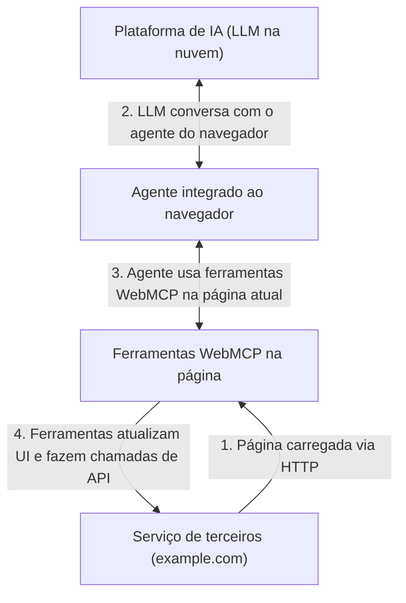

# 01 — Introdução ao WebMCP

## O que é WebMCP?

**WebMCP** (abreviação de *Web Model Context Protocol*) é um **padrão web proposto** que permite que desenvolvedores construam e exponham **ferramentas estruturadas** (`tools`) para **agentes de IA**. Em vez de o agente "adivinhar" como interagir com a sua página (lendo o DOM, tirando screenshots e simulando cliques), o próprio site **declara** o que cada elemento faz e como deve ser usado.

> **Termo-chave — Atuação (actuation)**: é o ato de um agente simular cliques de mouse e digitação de texto, como se fosse o usuário humano interagindo com o site. Pode ser uma tarefa única (clicar num link, preencher um campo) ou complexa (completar uma compra).

O WebMCP fornece JavaScript (`document.modelContext`) e **anotações em elementos HTML de formulário** para que os agentes saibam exatamente como interagir com os recursos da página, melhorando significativamente a **performance e a confiabilidade da atuação dos agentes**.

## Como o agente enxerga o site hoje vs. com WebMCP

| Sem WebMCP (atuação por scraping) | Com WebMCP (chamada de ferramenta) |
|---|---|
| Agente lê screenshots, DOM e accessibility tree | Site registra ferramentas com nome, descrição e schema |
| Simula cliques e digitação ("adivinhação") | Agente chama a função declarada com argumentos estruturados |
| Muitos passos, cada um sujeito a interpretação do LLM | Uma chamada determinística, desenhada pelo desenvolvedor |
| Frágil, lento, caro em tokens | Confiável, rápido, com validação por JSON Schema |

Vídeo demonstrativo (esquerda: agente faz scraping do DOM; direita: agente chama uma tool) disponível no [demo de agendamento de consultas](https://googlechromelabs.github.io/webmcp-tools/demos/explainer/#compare).

## Três pilares do WebMCP

1. **Descoberta (Discovery)** — um padrão para páginas registrarem ferramentas com agentes, como `checkout` ou `filter_results`.
2. **JSON Schemas** — definições explícitas de entradas e saídas esperadas, para reduzir alucinações e mal-entendidos.
3. **Estado (State)** — um entendimento compartilhado do contexto atual da página, para que o agente saiba quais recursos estão disponíveis para agir em tempo real.

O objetivo declarado do grupo é construir **APIs que qualquer navegador com capacidades agênticas possa implementar**, para que os usuários concluam tarefas mais facilmente.

## Onde o WebMCP aparece no navegador

No navegador (a partir do Chrome 146/149), o WebMCP aparece na página como `document.modelContext`. Com essa superfície, um site pode expor um conjunto de ferramentas para agentes rodando no navegador — o que significa que os agentes **não precisam mais adivinhar o caminho** por uma página feita para humanos.

> **Nota**: `navigator.modelContext` foi **deprecado no Chrome 150**. Use `document.modelContext`.

Uma página que usa WebMCP pode ser pensada como um **servidor MCP dentro da página**: implementa ferramentas em script do lado do cliente, em vez de no backend.

## Tipos de agentes que podem usar WebMCP

- **Agente do navegador (browser's agent)**: fornecido pelo próprio navegador (embutido ou via extensão/plug-in), opera em paralelo ao event loop da página.
- **Agentes "in-page"**: agentes em JavaScript, vivendo na própria página ou em `<iframe>`s, que usam `document.modelContext.getTools()` para descobrir e chamar ferramentas.
- **Agentes de plataformas de IA (AI platforms)**: ChatGPT, Claude, Gemini etc. — desde que atuem sobre o navegador.
- **Extensões de Chrome**: podem consultar e executar ferramentas WebMCP por meio de content scripts.
- **Tecnologias assistivas**: WebMCP habilita agentes a atuarem como intermediários para usuários de tecnologias assistivas (não é consumido diretamente pela árvore de acessibilidade).

## Fluxo geral (WebMCP in-browser)

## O que WebMCP suporta em termos práticos

- **Preenchimento de formulários estruturados** — ex.: tool `submit_application` que mapeia corretamente dados da conversa para os campos (diferenciando nome completo de primeiro/último nome).
- **Interações em interfaces human-first** — ex.: tool `date_pick` para seleção complexa de data/hora em reservas, que agentes não entenderiam olhando só o DOM.
- **Debugging de aplicações** — ex.: tool `run_diagnostics` numa página de configurações para desenvolvedores, acionando correções escondidas atrás de menus aninhados.
- **Suporte ao cliente** — ajudar o agente a navegar até o formulário certo e preenchê-lo com dados do usuário.
- **Reservas de viagem** — viagens multi-cidade e multi-passageiro com menos passos.

## Melhorias-chave ao produto

- **Progressivo**: pode ser adicionado como *progressive enhancement* — se o navegador não suportar, a página se comporta exatamente como antes.
- **Confiança**: as ferramentas executam **visivelmente** na página, então o usuário confia que as tarefas foram concluídas como esperado; a marca e as escolhas de design human-centered permanecem intactas.
- **Ações sensíveis**: para ações sensíveis (como compras), o site pode incluir um comando para **solicitar interação do usuário** com um diálogo de confirmação.

## Materiais de referência

| Item | Link |
|---|---|
| Explainer | https://github.com/webmachinelearning/webmcp |
| Origin trial | https://developer.chrome.com/origintrials/#/register_trial/4163014905550602241 |
| Chrome Status | https://chromestatus.com/feature/5117755740913664 |
| Intent to Experiment | https://groups.google.com/a/chromium.org/g/blink-dev/c/gmYffo5WOE8/m/OJxuQRP3AAAJ |
| Especificação | https://webmachinelearning.github.io/webmcp |
| Tipos TypeScript | pacote npm `webmcp-types` |
| Demos | https://github.com/GoogleChromeLabs/webmcp-tools/tree/main/demos |

Continue para o próximo guia: **[02 — Motivação: atuação vs ferramentas](02-motivacao-atuacao-vs-tools.md)**.
