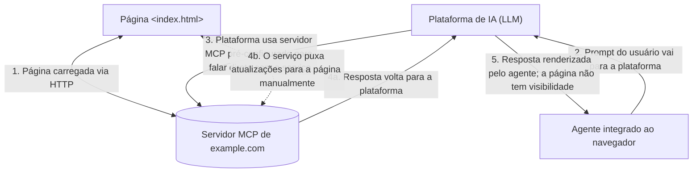

# 02 — Motivação: atuação vs ferramentas, MCP vs WebMCP

## O problema que o WebMCP resolve

A web foi construída assumindo que há uma **pessoa do outro lado**: alguém para ler a página, clicar em botões e preencher formulários. Mas cada vez mais visitas vêm de **agentes de IA** em vez de humanos, navegando uma internet feita para humanos.

A abordagem tradicional é o **crawler**: copia o conteúdo de volta para um servidor e, com frequência, não entrega tráfego nem crédito ao site original. A proposta do WebMCP é um caminho melhor, **sem scraping**.

### O custo da atuação baseada em "adivinhação"

Sem ferramentas estruturadas, os agentes de uso geral dependem de **observar o estado do navegador** combinando:

- screenshots da página;
- snapshots do DOM;
- snapshots da árvore de acessibilidade;

e então interagir **simulando entrada do usuário humano** (cliques, digitação, rolagem).

Isso funciona, mas:

- é **frágil** — cada passo está aberto a interpretação do LLM;
- é **lento e caro em tokens** — o agente gasta tokens em navegação, não em tarefa;
- cada pequena mudança de layout pode quebrar o fluxo;
- o desenvolvedor do site não tem **controle** sobre como e se o agente interage com o site.

> O WebMCP dá ao desenvolvedor da web **mais controle sobre se e como** um agente baseado em IA interage com o site, e dá aos agentes uma alternativa mais confiável.

## WebMCP como "servidor MCP dentro da página"

Páginas que usam WebMCP podem ser pensadas como **servidores in-page do Model Context Protocol (MCP)** que implementam ferramentas expondo lógica do lado do cliente e interação com o DOM, em vez de APIs do lado do servidor.

O WebMCP compartilha o **vocabulário comum** com o MCP (tools, schemas, parameters), mas é uma solução **nativa da web**, desenhada para o navegador.

### Comparação: integração de backend vs. WebMCP no navegador

**Integrações de backend** (Model Context Protocol, OpenAPI etc.):
- O serviço registra ferramentas numa plataforma de IA.
- A plataforma fala **direto com o backend** do serviço via API.
- O usuário usa as ferramentas conversando com o chat.

Funcionam bem para ações server-side, mas têm problemas para aplicações web interativas:

| Problema | Descrição |
|---|---|
| **Desintermediação da UI e perda de contexto** | A integração acontece entre agente e serviço, **desviando** da UI / experiência do navegador. |
| **Replicação de estado e autenticação** | O desenvolvedor precisa replicar o estado do usuário, o contexto ativo e as credenciais num servidor separado. |
| **Carga para o desenvolvedor** | Expor capacidades client-side exige escrever um servidor backend dedicado, em vez de reutilizar JavaScript do lado do cliente. |

**WebMCP** é a alternativa client-side: define ferramentas diretamente no script da página do navegador. Isso possibilita um **interplay visualmente rico e cooperativo** entre usuário, página e agente, com contexto compartilhado.

### Fluxo de integração direta de backend MCP (para comparar)

Note que, no fluxo MCP backend, **a página da web não tem visibilidade nem controle** sobre o que acontece.

## Objetivos e não-objetivos

### Objetivos (Goals)

- **Habilitar fluxos human-in-the-loop**: cenários cooperativos em que usuários delegam tarefas a agentes mantendo visibilidade, histórico e controle das páginas web.
- **Simplificar a integração de agentes**: agentes mais confiáveis e úteis interagindo com sites por meio de ferramentas client-side bem definidas, em vez de atuação frágil de UI (scraping de DOM, cliques simulados).
- **Prevenir a desintermediação do conteúdo web**: adaptar os front-ends para uso por agentes, em vez de substituí-los por integrações backend.
- **Reuso de código**: qualquer tarefa que um usuário consegue fazer pela UI pode virar uma tool reutilizando o código client-side existente.
- **Melhorar acessibilidade por meio de agentes**: permitir que agentes atuem como intermediários capazes para usuários de tecnologia assistiva.

### Não-objetivos (Non-Goals)

- **Cenários headless**: embora seja possível rodar as ferramentas em ambientes headless, a API é primariamente desenhada para **fluxos de navegador local com um humano no loop**.
- **Fluxos totalmente autônomos**: não é para agentes autônomos sem supervisão humana ou sem UI de navegador presente.
- **Substituir integrações de backend**: WebMCP complementa, não substitui, protocolos como MCP.
- **Substituir interfaces humanas**: a interface web humana continua primária; as ferramentas de agente aumentam, não substituem, a interação do usuário.

## Técnicas de atuação web existentes

Uma das motivações é tornar a web mais acessível a agentes de IA de propósito geral. O WebMCP **não conflita** com as técnicas de automação existentes: se um agente ou ferramenta assistiva perceber que a tarefa não é alcançável pelas ferramentas WebMCP oferecidas, ele pode **cair para automação geral de navegador** (screenshots, DOM, acessibilidade) para tentar cumprir a tarefa.

## WebMCP e a abordagem do Cloudflare

A Cloudflare resume bem a tensão: *"A web foi construída na suposição de que há uma pessoa na outra ponta."* O WebMCP permite que **agentes tenham uma experiência de navegação diferente da do usuário** e usem tokens em **tarefas, não em navegação**. (Detalhes da implementação da Cloudflare no [guia 11](11-cloudflare-webmcp.md).)

## Por que uma API web-native em vez de adotar o MCP backend diretamente?

Alternativas consideradas pelo grupo (detalhes no [guia 07](07-especificacao-tecnica.md)):

1. **Adoção direta do MCP backend**: descartada porque o MCP foi feito para comunicação server-client (stdio/SSE) e **não tem conceitos web nativos** — origins, permissões do navegador, integração com DOM, ciclo de vida de abas. Acoplar a uma API a um protocolo backend em evolução ativa prejudicaria retrocompatibilidade e estabilidade.
2. **Manifests estáticos declarativos**: úteis para descoberta offline, mas **impedem registrar/atualizar/remover ferramentas dinamicamente** com base no estado da página ou autenticação, e **não contêm código executável**.
3. **Execução por eventos (`toolcall`)**: separa schema da implementação, dificulta manter definições e código em sincronia e leva a `switch-case` gigantes. Uma variante híbrida (evento antes de cair no `execute` registrado) ainda é considerada.

## Por que "imperativa" e "declarativa" coexistem?

Pergunta recorrente: *"por que a API declarativa (formulários) não é suficiente?"*

Resposta: o WebMCP não é limitado a ferramentas declarativas pelo **mesmo motivo que sites não podem ser construídos exclusivamente com formulários declarativos**. Parte da funcionalidade da web só é possível com JavaScript. Para o WebMCP representar a funcionalidade completa da web para os agentes, ele precisa expor essa funcionalidade JavaScript por meio de ferramentas imperativas, não apenas declarativas.

---

Próximo: **[03 — Conceitos fundamentais e glossário](03-conceitos-glossario.md)**.
